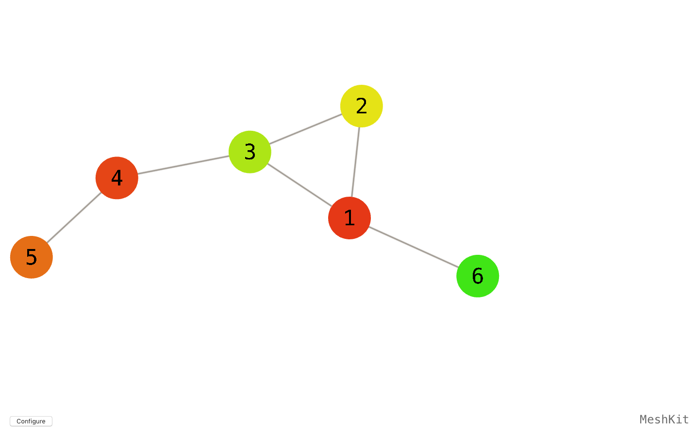

# MeshKit (Swift)

Visualizing Mesh Networks with Spritekit.

Project is based on [Spritekit-Force-Directed](https://github.com/joenot443/Spritekit-Force-Directed) by Joe Crozier, which is written in Objective-C. All credits go to this man.

#### Screenshots

